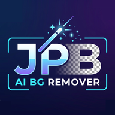

# 🎨 BG Remover AI

PWA (Progressive Web App) para **remover el fondo de imágenes con IA local**.
Funciona en **Android** y **Windows** sin subir tus fotos a ningún servidor.



---

## ✨ Características

- 🧠 **5 modelos IA** ejecutados localmente (ONNX + WASM):
  - `U²-Netp` (4.7 MB) — rápido, ideal para empezar
  - `Silueta` (44 MB) — buen balance
  - `U²-Net` (170 MB) — calidad general alta
  - `U²-Net Human` (176 MB) — especializado en personas
  - `ISNet General` (179 MB) — máxima calidad de bordes
- 💾 **Descarga automática + caché en IndexedDB**: el modelo se descarga solo la primera vez y queda disponible **offline** después.
- 🖌️ **Editor de máscara manual**:
  - Pincel ajustable (1–100 px) con previsualización circular del cursor
  - Modos **Añadir** y **Quitar**
  - **Varita mágica** con selección inteligente por color/borde
  - Cancelar / Aplicar con respaldo de la máscara
- 🎨 **Eliminar por color**: tolerancia (0–500), borde (0–10), suavizado (0–15), toma de color directamente de la imagen.
- 🖼️ **Rellenar fondo** con color sólido y opacidad ajustable.
- 🔲 **Fondo del lienzo** configurable (cuadrícula o sólido) por tema.
- 🌓 **Tema claro/oscuro** con switch deslizante.
- 💾 **Guardar en múltiples formatos**: PNG, JPEG, WebP, BMP.
  - Para JPEG: selector de calidad + **copia de metadatos EXIF** del original.
- 📋 **Copiar al portapapeles** la imagen procesada.
- 📱 **Instalable como app** en Android y Windows (PWA).
- ⌨️ **Atajos de teclado** (Windows): zoom con rueda, pan con SHIFT/ALT + rueda, pegar con Ctrl+V.
- 🆘 **Ayuda integrada** con guías paso a paso para Android y Windows.

---

## 🚀 Instalación y uso

### Requisitos

- Un navegador moderno con soporte para **WebAssembly** y **Service Workers**
  - ✅ Chrome / Edge (recomendado)
  - ✅ Firefox (parcial: el guardado usa fallback)
  - ✅ Safari (parcial: sin `showSaveFilePicker`)

### Ejecutar en desarrollo

La app usa **Web Workers** y **Service Workers**, así que **no puede abrirse desde `file://`**. Necesitas servirla por HTTP o HTTPS.

**Opción 1: Python**
```bash
# En la carpeta del proyecto
python -m http.server 8080
```
Luego abre `http://localhost:8080` en tu navegador.

**Opción 2: Node.js**
```bash
npx serve .
```

**Opción 3: VS Code**
Usa la extensión **Live Server**.

### Probar en Android

1. Levanta el servidor en tu PC (ver arriba).
2. Averigua tu IP local (ej. `192.168.1.50`):
   - Windows: `ipconfig`
   - Linux/Mac: `ifconfig` o `ip a`
3. En Chrome Android abre `http://192.168.1.50:8080`
4. Instala como app: menú **⋮** → *Añadir a pantalla de inicio*.

> ⚠️ Si usas HTTPS (por ejemplo, desplegado en Netlify/Vercel), funciona directamente.

---

## 📖 Uso

### 1. Abrir una imagen
- Pulsa **📂 Abrir** y selecciona un archivo.
- O **arrastra** la imagen a la ventana (Windows).
- O pega con **Ctrl+V** (Windows).
- O pulsa en *Seleccionar imagen* del estado vacío.

### 2. Remover el fondo
1. Elige un modelo en la sección **🧠 Modelo IA**.
   - **Recomendado empezar con U²-Netp** (solo 4.7 MB).
2. Pulsa **✨ Remover Fondo**.
3. La primera vez descargará el modelo (barra de progreso visible).
4. Las siguientes veces carga desde caché → es instantáneo.

### 3. Retoque manual (opcional)
- Activa **🖌️ Editor de Máscara**.
- Ajusta el **tamaño del pincel**.
- Elige **➕ Añadir** o **➖ Quitar**.
- Pinta directamente sobre la imagen.
- **🪄 Varita mágica**: activa y haz clic en una zona de color uniforme.
- **Cancelar / Aplicar** para confirmar.

### 4. Eliminar por color (opcional)
- Sección **🎨 Eliminar por Color**.
- Ajusta el color, tolerancia, borde y suavizado.
- Usa **💧** para tomar un color directo de la imagen.
- Pulsa **Aplicar eliminación**.

### 5. Rellenar el fondo (opcional)
- Sección **🖌️ Rellenar Fondo**.
- Activa *relleno de fondo*, elige color y opacidad.
- Pulsa **Aplicar**.

### 6. Guardar
- Pulsa **💾 Guardar**.
- Elige **carpeta y formato** (PNG, JPG, WebP, BMP).
- Si eliges JPG, aparecerá el diálogo de calidad y la opción de copiar **metadatos EXIF**.

---

## 📱 Instalación como app

### Android (Chrome)
1. Abre la app en Chrome.
2. Menú **⋮** → **Instalar app** o **Añadir a pantalla de inicio**.
3. Confirma. Se añadirá al cajón de apps.

### Windows (Chrome / Edge)
1. Abre la app en el navegador.
2. En la barra de direcciones aparecerá el icono **⊕ Instalar**.
3. Pulsa → se abrirá en su propia ventana.

---

## 🧱 Estructura del proyecto

```
bg-remover/
├── index.html          # Estructura de la app
├── styles.css          # Estilos (tema claro/oscuro)
├── app.js              # Lógica principal
├── db.js               # Wrapper de IndexedDB (caché de modelos)
├── model-worker.js     # Web Worker: descarga + inferencia ONNX
├── sw.js               # Service Worker (PWA offline)
├── manifest.json       # Manifiesto PWA
├── README.md           # Este archivo
└── icons/
    ├── icon-64.png     # Logo del header
    ├── icon-192.png    # Icono PWA
    ├── icon-512.png    # Icono PWA / splash
    ├── sun.png         # Tema claro
    ├── night.png       # Tema oscuro
    ├── aimodel.png     # Sección modelo IA
    ├── maskedit.png    # Editor de máscara
    ├── add.png         # Añadir
    ├── remove.png      # Quitar
    ├── ok.png          # Aplicar
    ├── cancel.png      # Cancelar
    ├── magic-wand.png  # Varita mágica / IA
    ├── deletecolor.png # Eliminar por color
    ├── pickcolor.png   # Tomar color
    ├── reset.png       # Reiniciar
    ├── open.png        # Abrir
    ├── save.png        # Guardar
    ├── copy.png        # Copiar
    ├── view.png        # Original/Procesado
    └── help.png        # Ayuda
```

---

## 🔧 Tecnologías

- **HTML5 + CSS3 + JavaScript** puro (sin frameworks)
- **Canvas 2D** para procesamiento de imágenes
- **ONNX Runtime Web** para inferencia IA en el navegador
- **Web Workers** para no bloquear la UI
- **IndexedDB** para cachear los modelos
- **File System Access API** para guardar con selector de carpeta
- **Service Worker** + **Web App Manifest** para PWA

---

## 💡 Consejos

- **Empieza con U²-Netp**: solo 4.7 MB, ideal para probar rápido.
- **Retratos**: usa **U²-Net Human**.
- **Bordes complejos** (pelo, encaje, ramas): usa **ISNet General**.
- **Fondos uniformes**: la **varita mágica** es la opción más rápida.
- **Metadatos EXIF**: actívalo si vas a publicar la foto y quieres conservar cámara/fecha/GPS.
- **Gestión de modelos**: revisa el espacio usado desde **⚙️ Gestionar modelos**.

---

## ⚠️ Limitaciones

- El procesamiento se hace en CPU (WASM). Un móvil de gama media puede tardar 5–30 s por imagen según el modelo.
- Los modelos grandes (170+ MB) pueden tardar en descargarse en conexiones lentas.
- La copia de **EXIF** solo funciona si el archivo original es **JPEG** y tiene bloque EXIF.
- **BMP** no soporta transparencia (se exporta sin canal alfa).

---

## 📄 Licencia

Este proyecto es de uso libre. Los modelos ONNX pertenecen a sus autores originales (U²-Net, ISNet, rembg).

---

## 🙏 Créditos

- Modelos de [rembg](https://github.com/danielgatis/rembg) y [U²-Net](https://github.com/xuebinqin/U-2-Net)
- Runtime de [ONNX Runtime Web](https://onnxruntime.ai/)